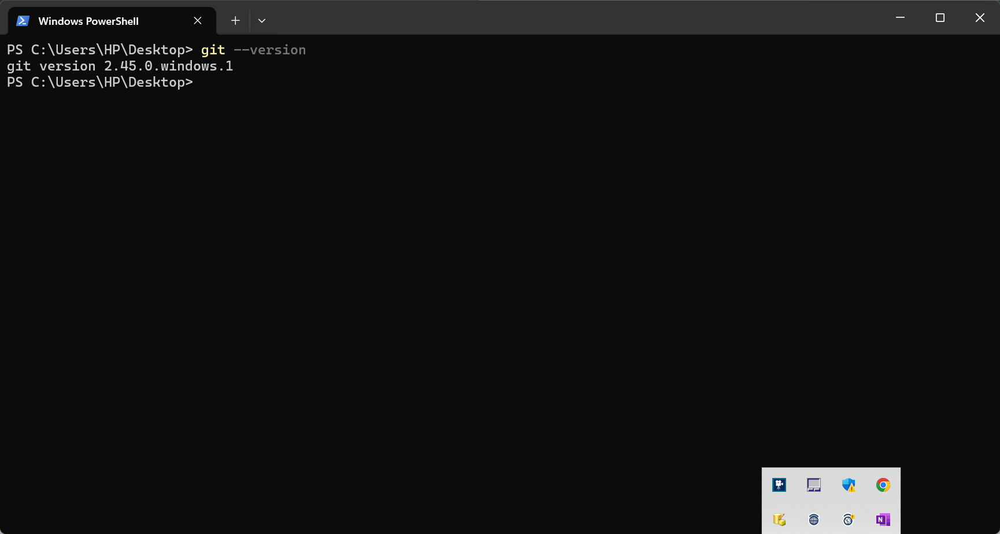

# git-mini-project

This project demonstrates fundamental Git workflows for managing changes in a simple web project. It covers the initial setup, basic operations, collaboration scenarios, and branch management.

## Project Structure

This project contains a basic `index.html` file and a series of images illustrating common Git commands and workflows.

## Git Workflows Illustrated

The following images demonstrate key Git workflows:

### 1. Git Installation and Configuration

This image shows the process of installing Git on a local machine and configuring essential user information (username and email). This is the first step to using Git for version control.

### 2. Cloning a Git Repository

This image illustrates how to clone an existing Git repository from a remote source (like GitHub) to a local machine using the `git clone` command.

### 3. Checking Git Status

This image demonstrates the use of the `git status` command to view the current state of the working directory and staging area. It shows which files have been modified, staged, or are untracked.

### 4. Adding Files to the Staging Area

This image shows how to use the `git add` command to move changes from the working directory to the staging area, preparing them for the next commit.

### 5. Committing Changes

This image illustrates the use of the `git commit` command to save a snapshot of the staged changes with a descriptive message. Commit messages are crucial for tracking the history of changes.

### 6. Pushing Changes to a Remote Repository

This image demonstrates the `git push` command, which uploads local commits to a remote repository, allowing for collaboration and backup.

### 7. Branch Management (Creating a Branch)

This image shows how to create a new branch using the `git branch` command. Branches allow for isolated development of new features or bug fixes.

### Tom and Jerry Workflow

The following images illustrate a collaborative workflow involving two users, Tom and Jerry, making modifications to the `index.html` file on separate branches:

**(Note: The specific actions of Tom and Jerry are not explicitly shown in the provided filenames. The following assumes a logical flow based on typical Git usage.)**

### [Assuming Image 8 shows Tom's initial work on a branch]

This image likely shows Tom switching to his own branch, making modifications to the `index.html` file, staging his changes, and committing them.

### [Assuming Image 9 shows Jerry's work on a separate branch]

This image likely shows Jerry similarly switching to his own branch, making different modifications to the `index.html` file, staging his changes, and committing them.

### [Assuming Image 10 shows Tom pushing his branch]

This image likely shows Tom using `git push origin <tom_branch_name>` to upload his branch and commits to the remote repository.

### [Assuming Image 11 shows Jerry pushing his branch]

This image likely shows Jerry using `git push origin <jerry_branch_name>` to upload his branch and commits to the remote repository.

### [Assuming Image 12 shows a Merge or Pull Request scenario]

This image might illustrate the process of merging Tom's and Jerry's branches together (either locally or through a pull request on a platform like GitHub) to integrate their changes into the main branch.

## GitHub Repository

[Insert your GitHub Repository URL here]

This repository contains the `index.html` file and the images described above, demonstrating the Git workflows. You can view the commit history and branches on GitHub.

**Note:** This README provides a description of the intended Git workflows based on the image filenames. To fully meet the submission requirements, ensure that your GitHub repository contains:

* Evidence of Git installation and configuration (this README and potentially the `1.git_installation.png` image).
* Screenshots showing Git repository cloning (`2.git_clone.png`) and branch management (`7.git_branch.png`, and potentially the Tom and Jerry workflow images).
* Specific branches and commits reflecting the individual work of "Tom" and "Jerry" on the `index.html` file, along with documentation of their commits and push operations (illustrated by images 8-11).
* A GitHub URL where these multiple branches can be reviewed.

Ensure that your repository structure and commit history align with these described workflows.