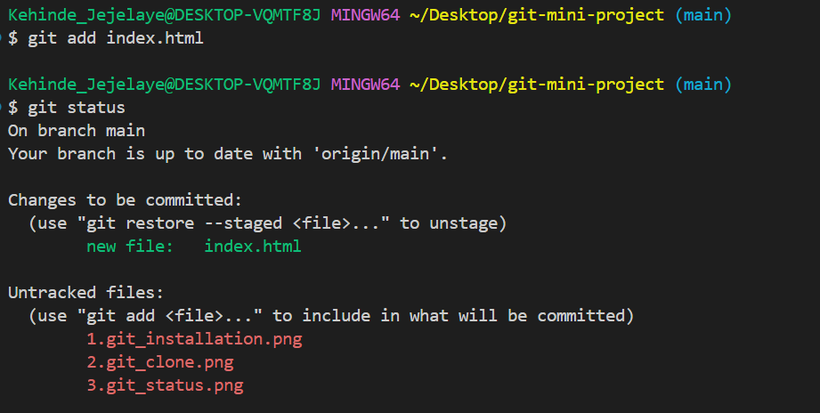

# git-mini-project

This project demonstrates fundamental Git workflows for managing changes in a simple web project. It covers the initial setup, basic operations, collaboration scenarios, and branch management.

**GitHub Repository:** [https://github.com/kehindejejelaye/git-mini-project](https://github.com/kehindejejelaye/git-mini-project)

This repository on GitHub serves as the central collaborative space for this project. It houses the `index.html` file, the illustrative images, and the complete Git history, including branches and commits from collaborators.

## Project Structure

This project contains a basic `index.html` file and a series of images illustrating common Git commands and workflows. The structure of the GitHub repository reflects this, with the `index.html` file at the root and the images likely within an `images` or similar directory.

## Git Workflows Illustrated

The following images demonstrate key Git workflows:

### 1. Git Installation and Configuration

This image shows the process of installing Git on a local machine and configuring essential user information (username and email). This is the first step to using Git for version control and ensures proper attribution of commits within the collaborative repository on GitHub.

### 2. Cloning a Git Repository

This image illustrates how to clone an existing Git repository from a remote source (like the central GitHub repository at [https://github.com/kehindejejelaye/git-mini-project](https://github.com/kehindejejelaye/git-mini-project)) to a local machine using the `git clone` command. This creates a local copy of the project, including its entire history and branches.

### 3. Checking Git Status

This image demonstrates the use of the `git status` command to view the current state of the working directory and staging area. It shows which files have been modified, staged, or are untracked in your local repository, reflecting changes made relative to the state of the GitHub repository.

### 4. Adding Files to the Staging Area

This image shows how to use the `git add` command to move changes from the working directory to the staging area, preparing them for the next commit that will be recorded in the local repository and eventually pushed to the shared GitHub repository.

### 5. Committing Changes

This image illustrates the use of the `git commit` command to save a snapshot of the staged changes with a descriptive message. These commits form the history of the project within both your local repository and the collaborative GitHub repository, allowing others to understand the evolution of the code.

### 6. Pushing Changes to a Remote Repository

This image demonstrates the `git push` command, which uploads local commits to the remote repository (origin, which typically points to [https://github.com/kehindejejelaye/git-mini-project](https://github.com/kehindejejelaye/git-mini-project)), allowing for collaboration and backup of your work on GitHub.

### 7. Branch Management (Creating a Branch)

This image shows how to create a new branch using the `git branch` command. Branches in your local repository, and subsequently on the GitHub repository, allow for isolated development of new features or bug fixes without directly affecting the main codebase.

### Tom and Jerry Workflow

The following images illustrate a collaborative workflow involving two users, Tom and Jerry, making modifications to the `index.html` file on separate branches within the shared GitHub repository at [https://github.com/kehindejejelaye/git-mini-project](https://github.com/kehindejejelaye/git-mini-project):

### [Assuming Image 8 shows Tom's initial work on a branch]

This image likely shows Tom switching to his own branch (e.g., `tom-feature`), making modifications to the `index.html` file in his local clone of the GitHub repository, staging his changes, and committing them. These commits are initially local to Tom's machine.

### [Assuming Image 9 shows Jerry's work on a separate branch]

This image likely shows Jerry similarly switching to his own branch (e.g., `jerry-fix`), making different modifications to the `index.html` file in his local clone of the GitHub repository, staging his changes, and committing them. These commits are initially local to Jerry's machine.

### [Assuming Image 10 shows Tom pushing his branch]

This image likely shows Tom using `git push origin tom-feature` to upload his `tom-feature` branch and its commits to the remote GitHub repository ([https://github.com/kehindejejelaye/git-mini-project](https://github.com/kehindejejelaye/git-mini-project)). This makes his work visible to other collaborators.

### [Assuming Image 11 shows Jerry pushing his branch]

This image likely shows Jerry using `git push origin jerry-fix` to upload his `jerry-fix` branch and its commits to the remote GitHub repository ([https://github.com/kehindejejelaye/git-mini-project](https://github.com/kehindejejelaye/git-mini-project)). This makes his work visible to other collaborators.

### [Assuming Image 12 shows a Merge or Pull Request scenario]

This image might illustrate the process of merging Tom's `tom-feature` branch and Jerry's `jerry-fix` branch into the main branch (likely `main` or `master`) on the GitHub repository ([https://github.com/kehindejejelaye/git-mini-project](https://github.com/kehindejejelaye/git-mini-project)). This could be done locally and then pushed, or more commonly through a pull request on the GitHub platform, allowing for code review and discussion before integration.

## GitHub Repository

**Access the complete project and its history, including all branches and commits, on GitHub at:** [https://github.com/kehindejejelaye/git-mini-project](https://github.com/kehindejejelaye/git-mini-project)

This repository contains the `index.html` file and the images described above, demonstrating the Git workflows in a collaborative environment. You can view the commit history, the different branches created by "Tom" and "Jerry," and the eventual merge operations directly on GitHub.

**Note:** This README provides a description of the intended Git workflows as they are reflected in the images and the GitHub repository. To fully understand the collaboration, please visit the GitHub repository ([https://github.com/kehindejejelaye/git-mini-project](https://github.com/kehindejejelaye/git-mini-project)) to examine:

* The commit history on the `main` branch.
* The separate branches created (e.g., `update-navigation`, `add-contact-info`).
* The individual commits made by "Tom" and "Jerry" on their respective branches, showing their modifications to `index.html`.
* The push operations that made these branches visible on the remote repository.
* Any merge commits or pull requests that integrated the changes from the feature branches back into the `main` branch.

The structure and commit history of the GitHub repository are integral to understanding the practical application of these Git workflows in a collaborative setting.